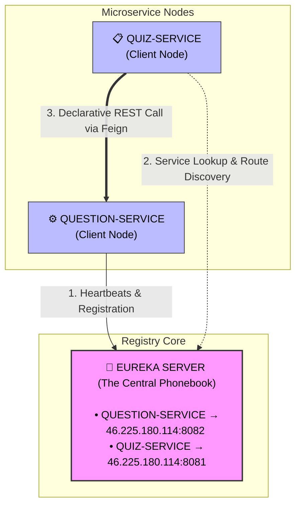

# 📓 Advanced Microservices Study Guide & Lab Documentation

Welcome to the central documentation hub for our distributed microservices platform. This guide explains how we decoupled our old monolithic architecture into smart, self-discovering nodes using **Spring Cloud Netflix Eureka** and **OpenFeign**.

---

## 🗺️ Architectural Concept: The "Why" Behind the Design

In our old monolithic system, everything lived under one roof. The `Quiz` and `Question` domains were tightly coupled. They shared a single database instance and directly called each other's classes in memory.

By splitting them into independent services (`quiz-service` and `question-service`), we created two standalone systems that manage their own separate databases. Because of this structural split, the services can no longer look at each other's database tables or memory pools directly.

Below is the engineering reasoning behind the new methods introduced in the Question Microservice:

### 1. `getQuestionsForQuiz(String category, Integer numQuestions)`
* **Purpose:** Returns a list of randomly selected question IDs matching a specific category and volume count.
* **Architectural Reasoning:** * **Database Isolation (Loose Coupling):** In a microservice ecosystem, the `Quiz Service` should **never** directly access the `Question` database tables. The Quiz Service only needs to know *what* quiz exists and *which* question IDs are inside it.
    * **Separation of Concerns:** Deciding which questions fit a specific category and randomly picking them is purely a feature of the question repository. The Quiz Service simply calls this endpoint to offload the question selection logic entirely.

### 2. `getQuestionsFromId(List<Integer> questionIds)`
* **Purpose:** Accepts a collection of unique question IDs as an input array and returns a payload of `QuestionWrapper` Data Transfer Objects (DTOs).
* **Architectural Reasoning:**
    * **Network Payload Optimization:** A `QuestionWrapper` excludes the `rightAnswer` field. When a user is actively taking a quiz, we cannot expose the correct answers in the HTTP network response payload (which would allow users to look at the answers via browser developer tools).
    * **Data Hydration:** The Quiz Service stores only raw question IDs to remain lightweight. When a frontend client requests to load a quiz, the Quiz Service uses this endpoint to "hydrate" those IDs into actual readable text, options, and titles.

### 3. `getScore(List<Response> responses)`
* **Purpose:** Accepts a list of user submissions (containing the question ID and the user's chosen answer) and calculates the total numeric score.
* **Architectural Reasoning:**
    * **Encapsulation of Secrets (Security):** The `rightAnswer` column lives strictly inside the Question Service's isolated database. To calculate a score, something has to compare the user's answer against the correct answer.
    * **Zero Leakage:** Instead of forcing the Question Service to send the correct answers over the network to the Quiz Service (which leaks data boundaries), the Quiz Service sends the user's responses *to* the Question Service. The Question Service evaluates the score internally where the data is safe, and returns only a single safe number (e.g., `5/10`).

---

## 📞 1. Declarative Inter-Service Communication via OpenFeign

### Why RestTemplate is an Anti-Pattern here
Initially, microservices used a utility called `RestTemplate` to send raw HTTP requests across network nodes. However, using `RestTemplate` requires you to hardcode the precise URL destination:
```java
// ❌ BAD PRACTICE: Hardcoding network routes
String url = "[http://46.225.180.114:8082/question/generate](http://46.225.180.114:8082/question/generate)";
```

In a modern cloud ecosystem, this approach fails instantly because:
Dynamic Ephemeral Nodes: Containers spin up and down constantly. Their IP addresses and ports change dynamically on every new orchestration deployment.
Brittle Pipelines: Hardcoding an IP means if a target VM migrates, your entire business pipeline instantly crashes.

### The Feign Client Paradigm
OpenFeign solves this issue by acting as a Declarative HTTP Client. Instead of writing boilerplate code to open sockets and issue HTTP requests, you define a standard Java interface using the @FeignClient annotation.

```java
@FeignClient("QUESTION-SERVICE") // 👈 Registers target using abstract logical service name
public interface QuestionInterface {

    @GetMapping("question/generate")
    public ResponseEntity<List<Integer>> getQuestionsForQuiz(
        @RequestParam String categoryName, 
        @RequestParam Integer numQuestions
    );

    @PostMapping("question/getQuestions")
    public ResponseEntity<List<QuestionWrapper>> getQuestionsFromId(
        @RequestBody List<Integer> questionIds
    );

    @PostMapping("question/getScore")
    public ResponseEntity<Integer> getScore(
        @RequestBody List<Response> responses
    );
}
```

**How Feign works under the hood:** At runtime, Spring reads your @FeignClient("QUESTION-SERVICE") declaration, queries the service discovery layer to find out where QUESTION-SERVICE is currently living, and handles the network calls automatically.  

### Enabling the Client Engine
To activate the compilation generation loop for your custom Feign interfaces, you must tag your primary bootstrapping launch configuration file with the activation flag:

```java
@SpringBootApplication
@EnableFeignClients // 👈 Vital: Instructs Spring Boot to scan for interfaces marked with @FeignClient
public class QuizServiceApplication {
    public static void main(String[] args) {
       SpringApplication.run(QuizServiceApplication.class, args);
    }
}
```

## 🔎 2.Dynamic Registry Management via Netflix Eureka

To stop hardcoding network pathways, we need a "phonebook" for our microservices. This central phonebook is Netflix Eureka Server.




### The Service Registry Setup (service_registry project)
To build the server component, we include the netflix-eureka-server module in our build profile:

```xml
<dependency>
    <groupId>org.springframework.cloud</groupId>
    <artifactId>spring-cloud-starter-netflix-eureka-server</artifactId>
</dependency>
```

We activate the dashboard directly on the main setup execution file:

```java
@SpringBootApplication
@EnableEurekaServer // 👈 Converts this standard application into a central service registry hub
public class ServiceRegistryApplication {
    public static void main(String[] args) {
        SpringApplication.run(ServiceRegistryApplication.class, args);
    }
}
```

### Server Parameter Customizations (application.properties)

```text
spring.application.name=service.registry
server.port=8761

# The hostname advertised inside our virtual environment
eureka.instance.hostname=eureka-server-01

# Operational Self-Preservation Toggles
eureka.client.fetch-registry=false
eureka.client.register-with-eureka=false
```

### 🧠 Concept Check - Why set these to false?
By default, every Eureka application attempts to find another cluster member to copy data from and register itself with. Since this node is the root directory server, setting these to false prevents the server from entering an infinite loop where it tries to register with itself.

## 🔬 3. Deep Dive: Code Refactoring & Persistence Changes

### Why do we need .getBody() when making Feign calls?
When interacting with your Feign clients, you see lines written like this:

```java
List<Integer> questionIds = questionInterface.getQuestionsForQuiz(category, numQ).getBody();
```

**The Reason:**

Feign clients wrap their raw network return values inside a Spring `ResponseEntity<T>` container wrapper object.
A `ResponseEntity` represents the **entire HTTP response wrapper**, which includes:
- **The Status Code:** (e.g., `200 OK`, `404 Not Found`)
- **The HTTP Headers:** Metadata detailing text limits, dates, and authentication rules.
- **The Response Body:** The actual core data returned by the backend service.
Because our `Quiz` entity specifically requires a raw collection of integers (`List<Integer>`) to save to the database, we use `.getBody()` to unpack the container, throw away the HTTP metadata headers, and extract the raw list payload inside.

**Database Mapping Refactoring:**

Moving from `@ManyToMany` to `@ElementCollection`
In our old monolithic database architecture, `Quiz` and `Question` were fully managed relational entities that shared a joint link table via an active `@ManyToMany` association map.

**The Monolith Approach (Shared Schema Model)**

```java
// ❌ MONOLITH CODE: Relies on foreign keys linking across tables
@ManyToMany
private List<Question> questions;
```

**The Microservice Approach (Decoupled Schema Model)**

```java
//  MICROSERVICE CODE: Relies strictly on flat value identifiers
@ElementCollection
private List<Integer> questionIds;
```

**Why this change is mandatory for Microservices:**
- No Cross-Service Foreign Keys: The `Quiz` entity lives inside the `quiz-service` database, while the `Question` entity lives inside the `question-service` database. A database cannot form an official foreign key constraint to an entirely separate database server across the network.
- Data Minimalism: The Quiz Service does not need to know the question text, options, or answer keys while sitting idle on disk. It only needs to keep track of a simple list of numbers (the IDs).
- How `@ElementCollection` works: It tells Hibernate to create a simple utility table on behalf of the Quiz Service. This table lists the `quiz_id` along with its corresponding `question_ids` as a collection of simple scalar data types (Integers), completely decoupling our data schemas.